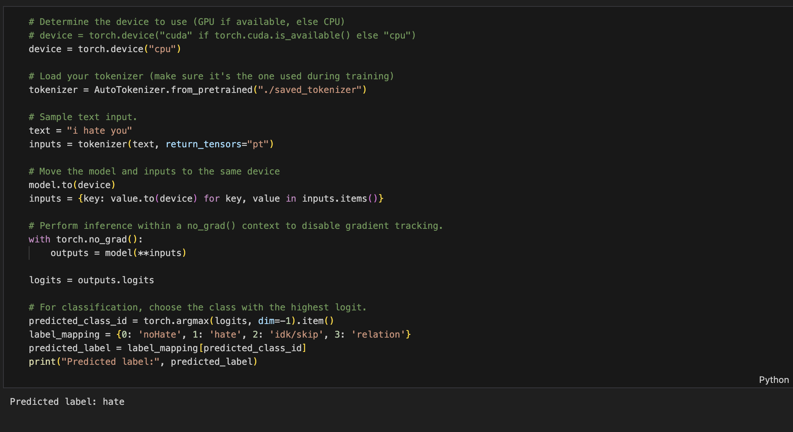
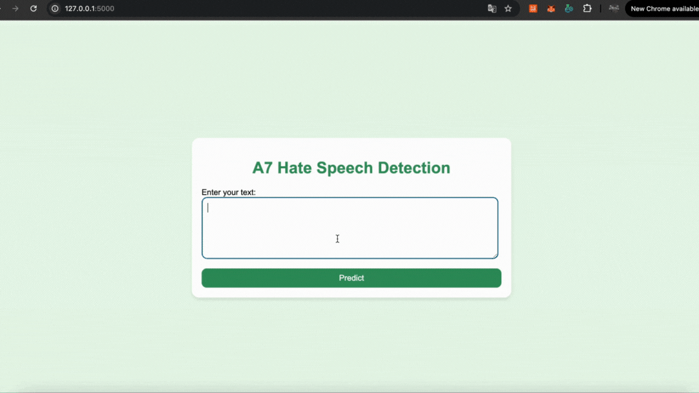

# A7-Training-Distillation-vs-LoRA
## st124738
## Sonakul kamnuanchai

## 1. Hate of speech Dataset:
- hugging face (hate_speech18) : datasets.load_dataset("hate_speech18")

## 2. Evaluation models trained DistilBERT with Odd Layers, Even Layers, and LoRA
- Training with 5 epoches

| Model Type         | Training Loss| Test Set Performance |
|---------------------|-----------|-----------|
|Odd Layer           | 0.3038   | 0.8860 |
|Even Layer            | 0.8613	  | 0.0180 |
|LoRA            | 0.3965	  | 0.8780 |

The best model is Distillation with Odd layer.

### Discuss the challenges
During implementation, one major challenge was identifying which layers of DistilBERT to fine-tune. Fine-tuning odd-numbered layers performed well, while even-numbered layers resulted in high training loss and poor test performance. This highlights the difficulty in selecting effective layers without thorough analysis. On the other hand, LoRA fine-tuning offered competitive accuracy with reduced training overhead, though it slightly underperformed compared to the best odd-layer model.

### Proposed Improvements
To address these challenges, I propose using layer-wise probing to guide fine-tuning decisions and adopting hybrid strategies that fine-tune only the most influential layers. For LoRA, performance can be improved by optimizing rank settings and combining it with other lightweight tuning methods like adapters or prefix tuning.

## 3. Sample Inference:
- This model will perform classification into four classes: noHate, hate, idk/skip, and relation.
- Sample_Text : "i hate you"

## 4. Demo
- python app.py

